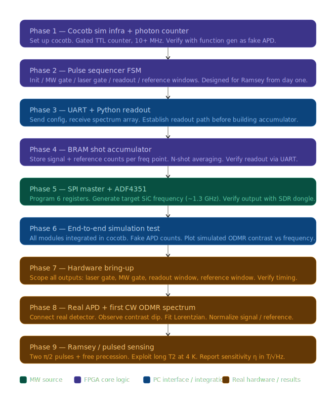

<div align="center">


# ramsey

### FPGA ODMR system


</div>

---

Open-source FPGA-based pulse sequencer and photon counter for optically detected magnetic resonance (ODMR) readout of spin defects in diamond and silicon carbide.

Targets the **Nexys Video Artix-7** development board (~$200). Designed to replace commercial instruments (PulseBlaster, NI DAQ) in quantum sensing experiments.

## How it works

Spin defects in diamond and SiC (NV centers, V2/PL6 silicon vacancies) act as atomic-scale magnetometers. Their electron spin has a resonance frequency set by the material's zero-field splitting $D$ plus a Zeeman shift proportional to the local magnetic field:

$$f_{\pm} = D \pm \gamma_e B \qquad \gamma_e = 28 \text{ MHz/mT}$$

A measurement shot has three phases:
1. **Initialise** — a laser pulse polarises the spin into the $m_s = 0$ state via spin-dependent fluorescence.
2. **Drive** — a microwave pulse at frequency $f$ attempts to transfer population to $m_s = \pm 1$.
3. **Readout** — photon counts in a signal window and a reference window are compared. A contrast dip $\Delta PL / PL$ appears when $f$ matches the spin transition.

Sweeping $f$ and fitting a Lorentzian to the dip gives $f_0$, from which the field follows directly: $B = (f_0 - D) / \gamma_e$.

A **Ramsey sequence** replaces the single long MW pulse with two short $\pi/2$ pulses separated by a free-precession time $\tau$. The spin accumulates phase $\phi = 2\pi \delta \tau$ (where $\delta = f - f_0$ is the MW detuning), producing oscillating contrast fringes as $\tau$ is swept. The fringe frequency gives $\delta$ and therefore $B$ with linewidth limited by $T_2^*$ rather than the MW pulse duration — significantly improving sensitivity.

See [`notebooks/odmr_physics.ipynb`](notebooks/odmr_physics.ipynb) for the full derivation, Cramér-Rao sensitivity bounds, and lock-in detection.

## What it does

- Generates laser and microwave pulse sequences for pulsed ODMR
- Counts photons in gated readout and reference windows
- Streams contrast data over UART to a Python GUI in real time
- Fits Lorentzian dips to extract resonance frequency → magnetic field
- Lock-in (FSK) detection mode for improved noise rejection

## System architecture



See [`docs/system_overview.md`](docs/system_overview.md) for a detailed description of each RTL module, the UART protocol, and the Python stack.

## Hardware

### Bill of materials

| Component | Part | Purpose |
|-----------|------|---------|
| FPGA board | Nexys Video (Artix-7 XC7A200T) | Pulse sequencer + photon counter |
| MW source | ADF4351 evaluation module | 35 MHz – 4.4 GHz sweep |
| Detector | Silicon APD with TTL output | Single-photon counting |

### Pin connections

All signals are 3.3 V LVCMOS. Connect the ADF4351 and APD to the Pmod headers as follows:

**Pmod JB — optical signals**

| JB pin | FPGA pin | Signal | Direction | Description |
|--------|----------|--------|-----------|-------------|
| 1 | V9 | `laser_gate` | Output | TTL gate to AOM or laser driver |
| 2 | V8 | `mw_gate` | Output | TTL gate to MW switch |
| 3 | V7 | `apd_in` | Input | TTL pulse train from APD |

**Pmod JC — ADF4351 SPI**

| JC pin | FPGA pin | Signal | Direction | ADF4351 pin |
|--------|----------|--------|-----------|-------------|
| 1 | Y6 | `spi_clk` | Output | CLK |
| 2 | AA6 | `spi_mosi` | Output | DATA |
| 3 | AA8 | `spi_le` | Output | LE |
| 4 | AB8 | `lock_detect` | Input | LD |

**UART (USB-UART bridge on-board)**

| Signal | FPGA pin | Baud |
|--------|----------|------|
| TX | AA19 | 115200 |
| RX | V18 | 115200 |

> **Note:** `rst_n` is on pin G4 (bank 35, 1.5 V). The IOSTANDARD must be `LVCMOS15` — using `LVCMOS33` holds the FPGA in permanent reset.

## UART protocol

Packet format: `[0xAA][TYPE][LEN_HI][LEN_LO][PAYLOAD][CRC]` — CRC is XOR of all payload bytes.

| Type | Code | Direction | Payload | Description |
|------|------|-----------|---------|-------------|
| INIT | `0x01` | Host → FPGA | — | Request handshake |
| CONFIG | `0x02` | Host → FPGA | timing params | Set pulse widths, shot count, frequency table |
| START | `0x03` | Host → FPGA | — | Begin sweep |
| ACK | `0x04` | FPGA → Host | — | Handshake response |
| DATA | `0x05` | FPGA → Host | contrast array | One sweep result |
| STATUS | `0x06` | FPGA → Host | status word | Error / lock-detect state |

See [`python/uart_comm.py`](python/uart_comm.py) for the reference implementation and [`docs/system_overview.md`](docs/system_overview.md) for full payload encoding.

## Repository layout

```
rtl/          SystemVerilog source — pulse sequencer, photon counter, UART, SPI
sim/          cocotb testbenches
constraints/  Nexys Video XDC pin constraints
scripts/      Vivado build TCL, logo and QR code generators
python/       GUI, Lorentzian fitting, UART comms, characterization script
notebooks/    Physics background (ODMR, Zeeman, shot noise, lock-in)
docs/         System overview and architecture diagram
assets/       Logo
data/         Characterization data schema
```

## Getting started

### Try the demo (no hardware needed)

```bash
cd python
pip install -r requirements.txt
python gui.py
```

Click **DEMO** in the GUI to run a synthetic ODMR sweep with realistic Poisson noise and live Lorentzian fitting — no FPGA or ADF4351 required.

### Build the bitstream

Requires Vivado 2024.x:

```bash
vivado -mode batch -source scripts/build.tcl
```

### Run with hardware

1. Flash the bitstream to the Nexys Video board.
2. Wire up Pmod JB (optical signals) and Pmod JC (ADF4351 SPI) as described above.
3. Connect via USB-UART, then in the GUI select the COM port and click **Connect → Init → Start**.

### Run simulations

```bash
cd sim/cocotb/<module>
python runner_<module>.py
```

All 49 tests should pass. Modules: `photon_counter`, `pulse_sequencer`, `uart_interface`, `shot_accumulator`, `spi_master`, `adf4351_ctrl`, `freq_calc`, `integration`.

## Sensors targeted

| Defect | Host | Zero-field splitting |
|--------|------|---------------------|
| NV center | Diamond | 2870 MHz |
| V2 silicon vacancy | 4H-SiC | 1350 MHz |
| PL6 | 4H-SiC | 1380 MHz |

## Status

- FPGA pulse sequencer and photon counter: working
- UART protocol and Python GUI: working
- ADF4351 SPI driver: implemented, bench test pending (module in transit)
- Lock-in (FSK) mode: implemented, not yet tested on hardware
- First light: pending ADF4351 arrival

## Documentation

- [`docs/system_overview.md`](docs/system_overview.md) — detailed RTL architecture, module descriptions, UART payload encoding
- [`notebooks/odmr_physics.ipynb`](notebooks/odmr_physics.ipynb) — ODMR physics, Zeeman effect, shot noise, lock-in detection

## Cite

If you use this system in your work, please cite:

```bibtex
@software{ramsey2026,
  author  = {Kleven, Fredrik},
  title   = {Ramsey: Open-Source FPGA ODMR Pulse Sequencer},
  year    = {2026},
  url     = {https://github.com/Kleven2k/ramsey}
}
```

## References

- [ODMR lab manual, Uni Siegen](https://www.physik.uni-siegen.de/nano-optics/education/teaching/lab_courses/odmr_manual_v1.3.1.pdf)

---

*Developed with assistance from Claude (Anthropic) for code generation and debugging.*
